# Takım İsmi   
IceCore   
# Takım Üyeleri   
Sultan Kocagöz   
Şeyma Özek   
# Ürün ile İlgili Bilgiler   
## Ürün adı   
AcademiWorld   
## Ürün Açıklaması   
Geliştirilen bu eğitim uygulaması, kullanıcıların zorlandıkları ya da saklamak istedikleri soruları sanal bir soru defteri olarak kaydetmelerine olanak tanır. Ayrıca, bu sorular zorluk seviyelerine göre sınıflandırılabilir.   

Uygulama, bir sanal not defteri işlevi de görerek kullanıcıların notlarını ders ve konu bazında kategorize etmelerine imkân sağlar. Not ekleme ve düzenleme sürecinde, yapay zeka desteği sayesinde içerikler hem bilgi açısından hem de yazım yönünden otomatik olarak iyileştirilebilir.

Bunlara ek olarak kullanıcılar; istedikleri dersin, belirli konularında, zorluk seviyesini ve soru sayısını kendilerinin belirlediği quizler oluşturabilirler.

Ayrıca, uygulama her gün kullanıcıya ufuk açıcı genel kültür soruları sunarak bilgi dağarcığını genişletmeye yardımcı olur.
## Ürün Özellikleri   
-Ders ve konu bazlı kategorize edilebilen sanal soru defteri.

-Soruları zorluk seviyelerine göre sınıflandırma.

-Ders ve konu bazlı kategorize edilebilen sanal not defteri.

-Notlara yapay zeka ile yazım ve içerik düzeltme desteği.

-Kullanıcının belirlediği ders, konu, zorluk ve soru sayısına göre quiz oluşturma.

-Günlük olarak sunulan genel kültür soruları ile bilgi geliştirme.

-Kullanıcı dostu, sade ve işlevsel arayüz.

-Şifremi unuttum özelliği

-Not ve soru içeriklerinin düzenlenebilir ve güncellenebilir yapıda olması.sorular için zorluk seviyesinin güncellenmesi ile ilerleme gösterme.

## Hedef Kitle   
-Sınavlara hazırlık yapan öğrenciler (LGS, YKS vb.)

-Ders notlarını düzenli tutmak isteyenler

-Kendi sorularını kaydedip tekrar etmek isteyenler

-Kendi ders notlarını dijital ortamda sınıflandırmak isteyenler

-Yapay zeka ile notlarını geliştirmek isteyen kullanıcılar

-Kendi konularına özel quizler hazırlayarak çalışmak isteyenler

-Her gün yeni bilgiler öğrenmek isteyenler

-Ufuk açıcı sorularla kendini geliştirmek isteyen yetişkin kullanıcılar

## Kullanılan Teknolojiler
-Frontend : Flutter, Dart, HTTP, Json   

-Backend : FastAPI, Python, SQLAlchemy, Pydantic, JWT, Alembic   

-Veritabanı : PostgreSQL   

-AI/ML Servisleri : Google AI API, Tesseract OCR   

-Dosya İşleme : Pillow(PIL), UUID   

-Mimari : RESTful API   

-Güvenlik : JWT Authentication, Password Hashing, CORS   

## Product Backlog   
[Trello Backlog Board](https://trello.com/b/YE8wi78c/hackathon2025)

## Ürün Görselleri 

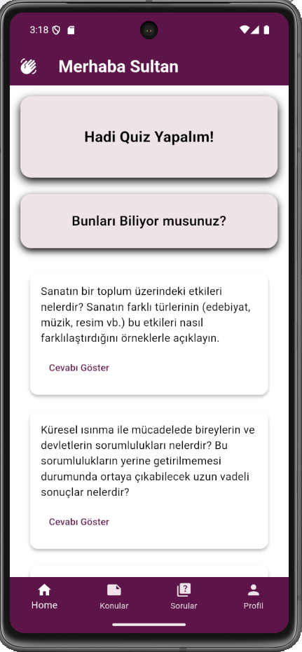 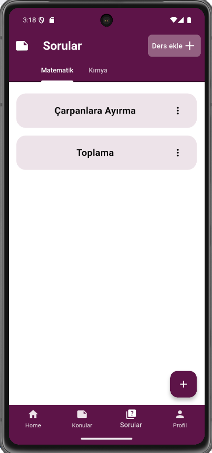 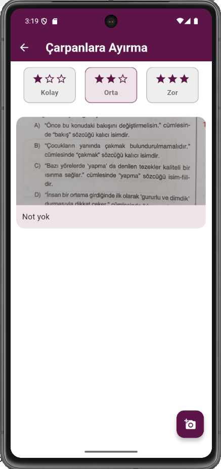 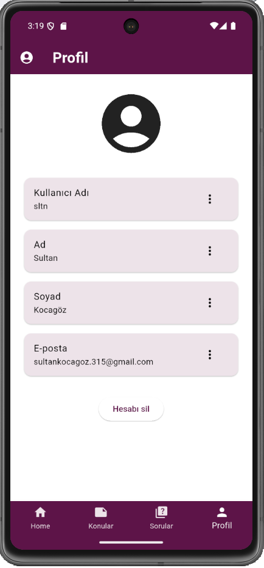   
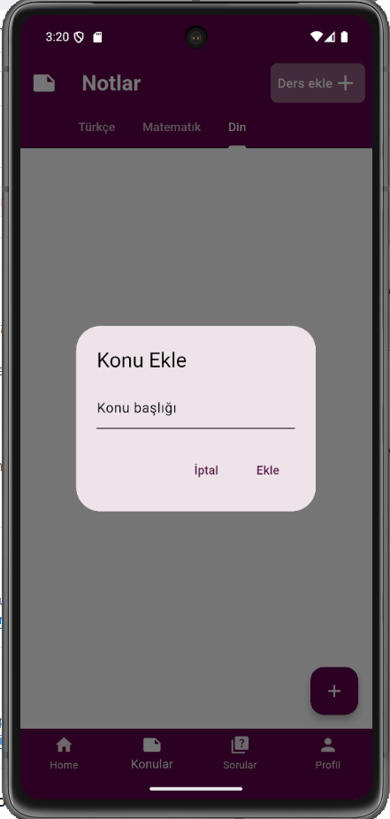 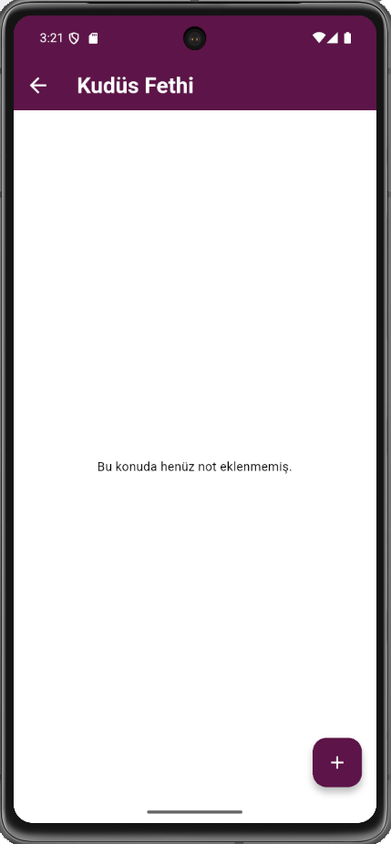 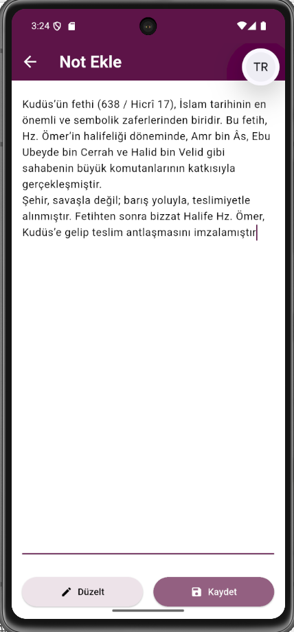 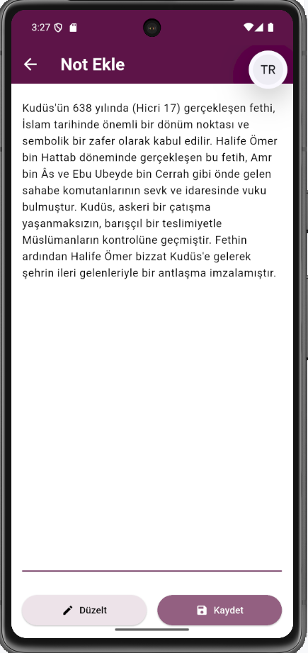   
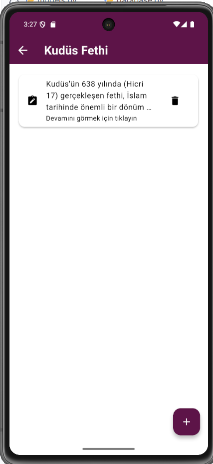 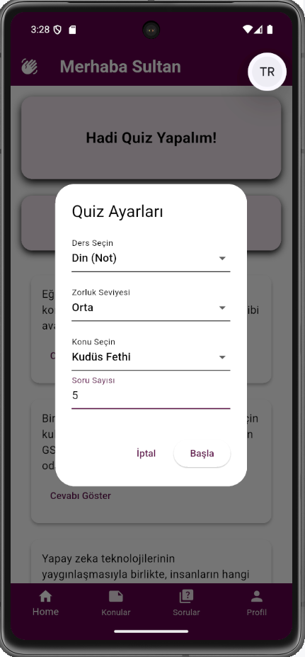 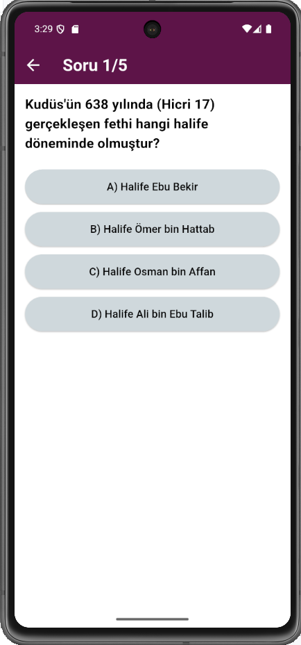

## Ürün Videosu
[AkademiWorld](https://youtube.com/shorts/Amoy0gs1gjk?si=qpzEP1gTRKq-cxtU)

